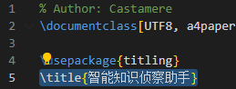
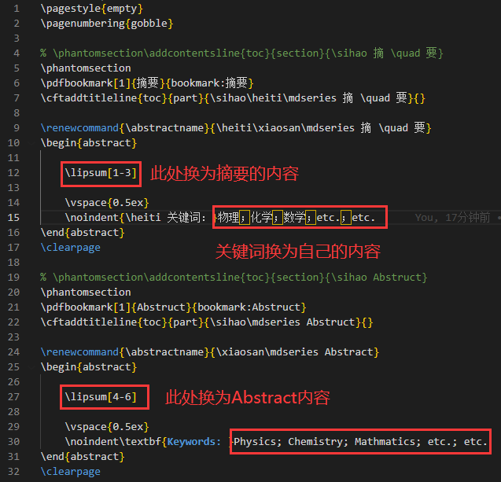
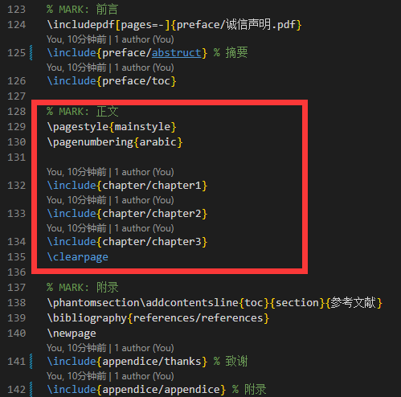

# LaTeX-GraduationTemplate

浙江理工大学计算机科学与技术学院毕设模板

# 指南

本模板使用前需安装好 **TeXworks**，使用 VS Code 编写编译，并在 VS Code 中安装 LaTeX Workshop 插件

1. 修改论文题目

   在 `template.tex` 第 5 行修改 title 至你的论文题目

   

2. 修改摘要

   修改 `preface/abstruct.tex`

   

3. 修改正文

   `template.tex` 中只有这部分需要修改，根据自己的章节数量增减即可。具体每一章节内容在 `chapter` 文件夹中修改

   

4. 修改致谢与附录

   致谢与附录都在 `appendice` 文件夹下
